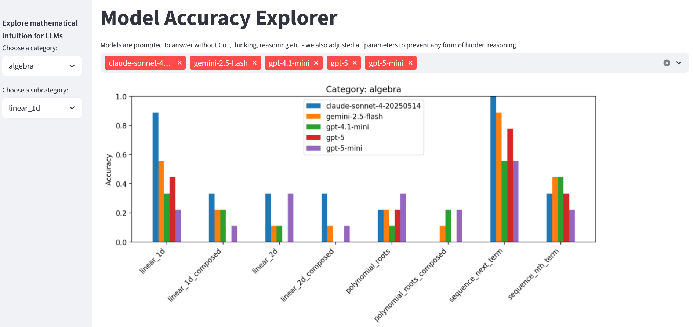

# LLM Mathematical Intuition

We test how well LLMs can solve mathematical problems adhoc (i.e. without any CoT, reasoning or breaking-down steps). I.e. the AI has to either guess the solution or it has an inner circuit to calculate it.

We use the Deepmind Mathematics Dataset to generate the problems.

<br/>


## Installation

Create an environment and install packages from requirements.txt, e.g.

```
uv venv
.venv\Scripts\activate # depends on your OS
uv pip install -r requirements
```

## Usage
Create data or use existing data in `data/questions.jsonl`.

Then solve the problems using an LLM. For example, using GPT-4.1-mini:
```
python solve.py --model gpt-4.1-mini
```
Then verify the answers from the model:

```
python verify.py --model gpt-4.1-mini
```

## Streamlit app

Run the streamlit app to interactively compare results for the different models:
```
streamlit run app.py
```

## Data

see also: https://github.com/google-deepmind/mathematics_dataset

mathematics_dataset contains/generates mathematical question/answer pairs in the following categories

* **algebra** (linear equations, polynomial roots, sequences)
* **arithmetic** (pairwise operations and mixed expressions, surds)
* **calculus** (differentiation)
* **comparison** (closest numbers, pairwise comparisons, sorting)
* **measurement** (conversion, working with time)
* **numbers** (base conversion, remainders, common divisors and multiples,
  primality, place value, rounding numbers)
* **polynomials** (addition, simplification, composition, evaluating, expansion)
* **probability** (sampling without replacement)

You can generate the data using the `generate` script. For example:

```
python generate --filter algebra__linear_2d --n_train 1000
```

This will generate 1000 samples of the algebra__linear_2d category. Leave out filter to generate from all default categories.

You can also use the mathematics_dataset package to create custom exercise datasets. See https://github.com/google-deepmind/mathematics_dataset


## Example questions

```
Question: Solve -42*r + 27*c = -1167 and 130*r + 4*c = 372 for r.
Answer: 4

Question: Calculate -841880142.544 + 411127.
Answer: -841469015.544

Question: Let x(g) = 9*g + 1. Let q(c) = 2*c + 1. Let f(i) = 3*i - 39. Let w(j) = q(x(j)). Calculate f(w(a)).
Answer: 54*a - 30

Question: Let e(l) = l - 6. Is 2 a factor of both e(9) and 2?
Answer: False

Question: Let u(n) = -n**3 - n**2. Let e(c) = -2*c**3 + c. Let l(j) = -118*e(j) + 54*u(j). What is the derivative of l(a)?
Answer: 546*a**2 - 108*a - 118

Question: Three letters picked without replacement from qqqkkklkqkkk. Give prob of sequence qql.
Answer: 1/110
```

## License

This project is licensed under the MIT License.


